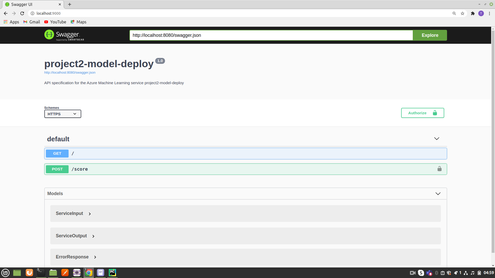
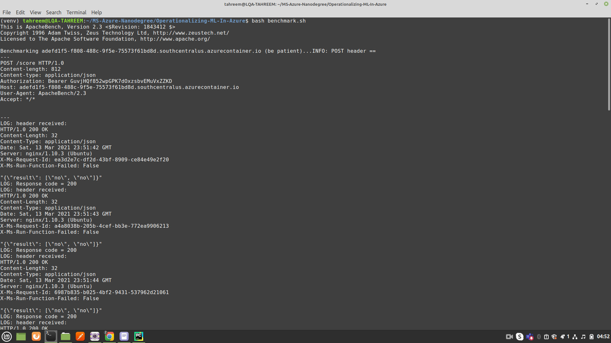

# Operationalizing Machine Learning in Azure

It is the second project of Machine Learning Engineer with Microsoft Azure Nanodegree Program, in which we have to operationalize a machine learning pipeline. In this project, we have used the Bank Marketing dataset. In the first stage, we create an AutoML experiment run to build a classifier, deploy the best model as a rest endpoint, and consume it via HTTP post requests. We also enabled the application insights for the endpoint, along with generating the swagger documentation for it. After these steps, in the next stage,  we create, publish and consume an AutoML pipeline with an AutoML Step using the Python SDK for Azure AutoML.

## Architectural Diagram
The architectural diagram of the project is given below:

## Key Steps
The key steps involved in operationalizing a Machine Learning Pipeline in Azure are listed below:

### Step 1: Authentication

For the completion of this project, I have used the labs provided by Udacity. So, I skipped the authentication step.

### Step 2: Automated ML Experiment

The very first step is to upload the Bank Marketing dataset in Azure ML Studio. It can be seen in the registered datasets tab of Azure ML Studio. This dataset comprises 21 columns and 10000 rows.

After uploading the dataset, the next step is to initiate an AutoML experiment run to build a classifier with accuracy as primary metric, exit criterion 1 hour and concurrency as 5. A *STANDARD_DS12_V2* compute-cluster with minimum 1 node and maximum 6 nodes, is configured to run the experiment. 

The best model selected in the AutoML run is VotingEnsemble, giving an overall accuracy of 92.018%.

### Step 3: Deploy the Best Model

The best model which is VotingEnsemble in this project, is deployed as a Rest Endpoint, using the Azure Container Instance with authentication enabled. 

### Step 4: Enable Application Insights

After deployment of the best model, application insights for this model is enabled to retrieve logs by modifying the *logs.py*. The enabled application insights can be seen in the screenshot below:

The following screenshot demonstrate the retrieval of logs by running *logs.py*.

### Step 5: Swagger Documentation

For this step, swagger.json file is downloaded from the swagger URI available in the details tab of the deployed model endpoint.

After downloading swagger.json in the swagger directory, *swagger.sh* is executed to run the swagger container on localhost port 9000. The *serve.py* is also executed to run a python server on localhost port 8080.  

The screenshots below show that swagger is running on localhost port 9000, and the swagger documentation for the deployed model can be accessed on localhost port 8080. 

### Step 6: Consume Model Endpoints

In this step, the deployed model is consumed by executing the *endpoint.py* file which contains two post request payloads.

### Step 7: Benchmarking the Endpoint

In this step, the deployed model is load-tested by utilizing Apache Benchmark.

### Step 8: Create, Publish and Consume a Pipeline

In this step, an AutoML pipeline is created, published and consumed with AutoML Step using the Python SDK for Azure AutoML. The screenshots of various steps of this process are attached below: 

## Screen Recording

The screencast of the project can be accessed [here](https://youtu.be/l4YIerlDakU).

## Standout Suggestions

I have attempted the optional deployed model load-testing step using Apache Benchmark.

## Future Improvements
* Data cleaning and preprocessing can be employed to obtain better results.
* In this project, only machine learning algorithms are used. Deep learning algorithms can be utilized in future to obtain better performance.
